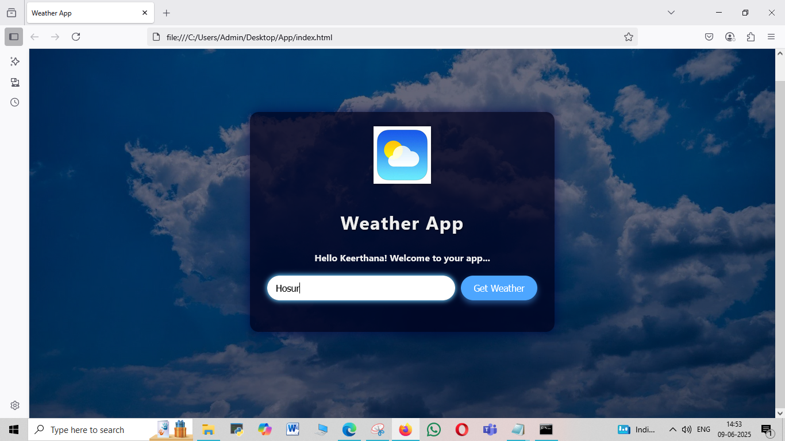
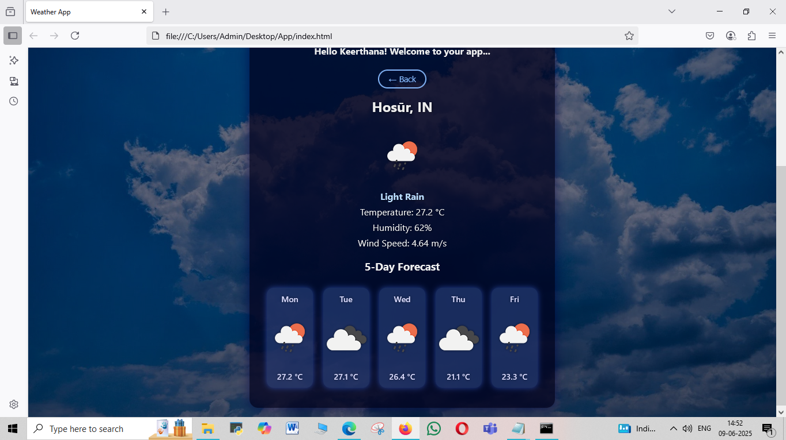

# 🌦 Weather App

A simple and responsive weather app built using HTML, CSS, and JavaScript. It allows users to search for real-time weather information by city.

## 🔍 Features

- 🔎 Search weather by city name
- 🌡 Displays temperature, humidity, and weather description
- 🎨 Clean and responsive user interface
- ☁ Fetches real-time data using OpenWeatherMap API

## 🚀 Technologies Used

- HTML5
- CSS3
- JavaScript (Vanilla)
- OpenWeatherMap API

## 🛠 Getting Started

To run this project locally:

1. *Clone the repository*  
   git clone https://github.com/Keerthana-Venkatesh/Weather-app.git
2. *Navigate to the project folder*  
   cd Weather-app  
3.*Open index.html*  
    double click index.html  
   
## Preview

## Live Demo 

[Click here to view the Weather App](https://Keerthana-Venkatesh.github.io/Weather-app/)
